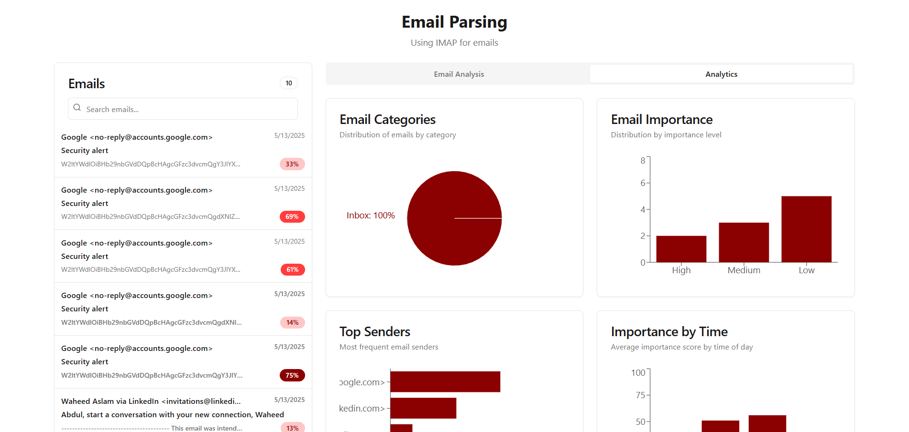

# Email Parser IMAP

A modern web application for parsing and analyzing emails via IMAP. This application allows users to connect to their email accounts, fetch emails, and analyze their content using AI.



## 🚀 Features

- **IMAP Email Connection**: Connect to any email account using IMAP protocol
- **Email Parsing**: Parse email content, attachments, and metadata
- **AI-Powered Analysis**: Analyze emails using Groq AI to extract:
  - Email summaries
  - Key insights
  - Sentiment analysis
  - Entity recognition
  - Action items
  - Topic classification
- **Modern UI**: Clean, responsive interface built with React and Shadcn UI
- **Secure**: Your email credentials are never stored

## 🛠️ Tech Stack

### Frontend
- React 18
- TypeScript
- Vite
- Tailwind CSS
- Shadcn UI Components
- React Query
- React Router

### Backend
- Node.js
- Express
- IMAP library
- Mailparser

### AI Integration
- Groq API (LLaMA 3 70B model)

## 📋 Prerequisites

- Node.js 18 or higher
- npm or yarn
- A Groq API key (get one at [groq.com](https://console.groq.com))
- An email account with IMAP access enabled

## 🚀 Getting Started

### Clone the repository

```bash
git clone https://github.com/Raufjatoi/Email-Parser-imap.git
cd email-parser-imap
```

### Install dependencies

```bash
# Install frontend dependencies
npm install

# Install backend dependencies
cd backend
npm install
cd ..
```

### Set up environment variables

Create a `.env` file in the root directory:

```
VITE_GROQ_API_KEY=your_groq_api_key_here
VITE_API_URL=http://localhost:3001
```

Create a `.env` file in the backend directory:

```
PORT=3001
NODE_ENV=development
```

### Run the application

```bash
# Start the backend server
cd backend
npm run dev

# In a new terminal, start the frontend
cd ..
npm run dev
```

The application will be available at http://localhost:8080

## 🌐 Deployment

### Backend (Vercel)

1. Push your code to GitHub
2. Connect your repository to Vercel
3. Set the root directory to `backend`
4. Set the build command to `npm install`
5. Set the output directory to `.`
6. Add environment variables in the Vercel dashboard

### Frontend (Netlify)

1. Push your code to GitHub
2. Connect your repository to Netlify
3. Set the build command to `npm run build`
4. Set the publish directory to `dist`
5. Add environment variables in the Netlify dashboard

## 📝 Usage

1. Open the application in your browser
2. Enter your email credentials and IMAP server details
3. Connect to your email account
4. Browse and select emails to analyze
5. View the AI-generated analysis of your emails

## 🔒 Security

- Email credentials are only used for the current session and are never stored
- All communication with the email server is done securely
- The application uses environment variables to protect API keys

## 🤝 Contributing

Contributions are welcome! Please feel free to submit a Pull Request.

1. Fork the repository
2. Create your feature branch (`git checkout -b feature/amazing-feature`)
3. Commit your changes (`git commit -m 'Add some amazing feature'`)
4. Push to the branch (`git push origin feature/amazing-feature`)
5. Open a Pull Request


## 📞 Contact

Abdul Rauf Jatoi - [website](https://raufjatoi.vercel.app) 

Project Link: [https://github.com/Raufjatoi/email-parser-imap](https://github.com/Raufjatoi/email-parser-imap)

